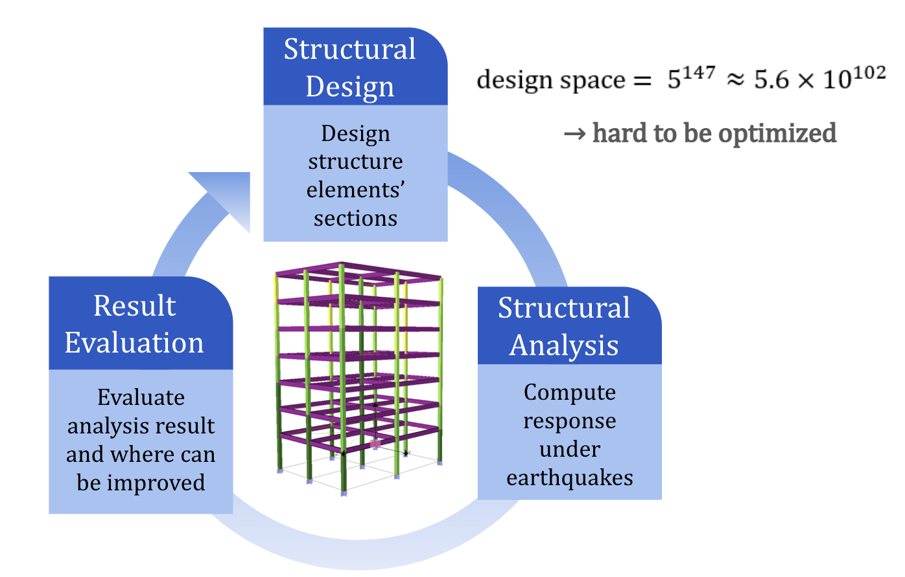
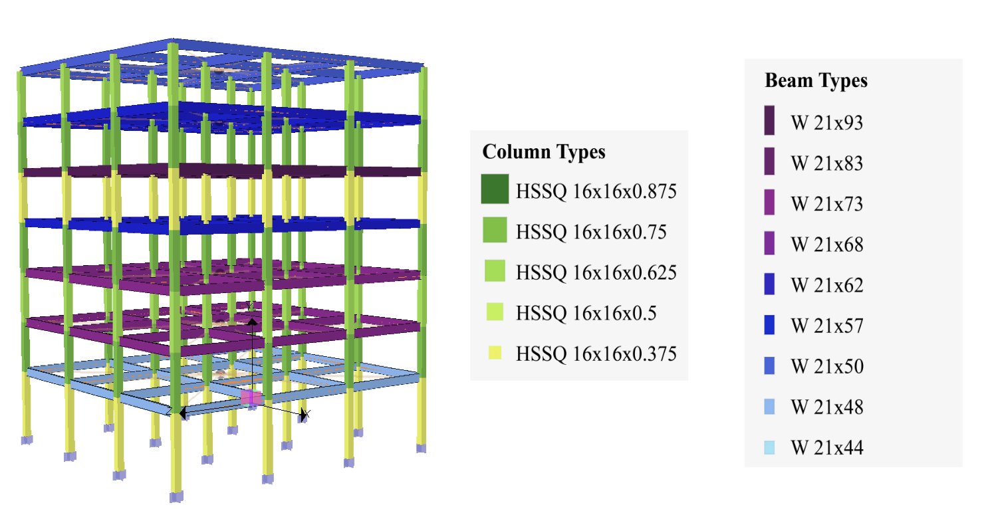
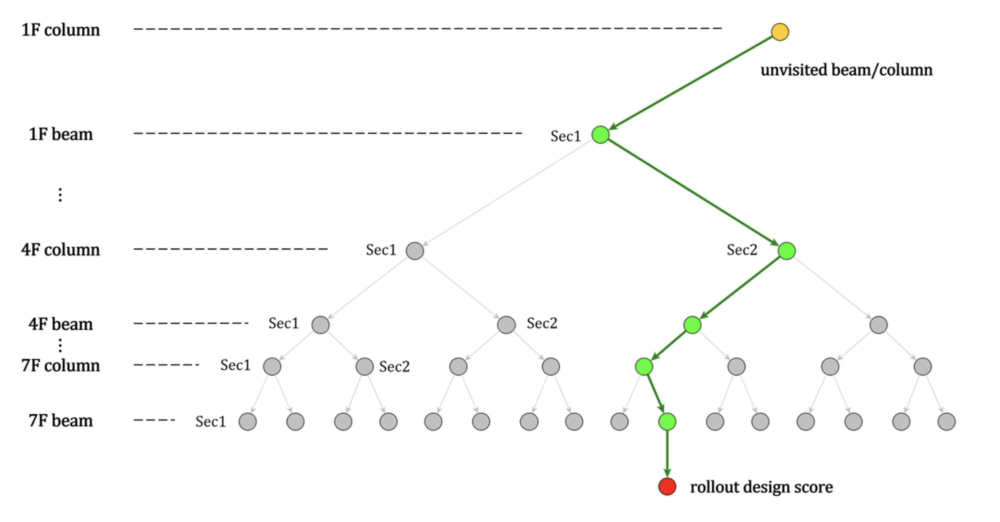
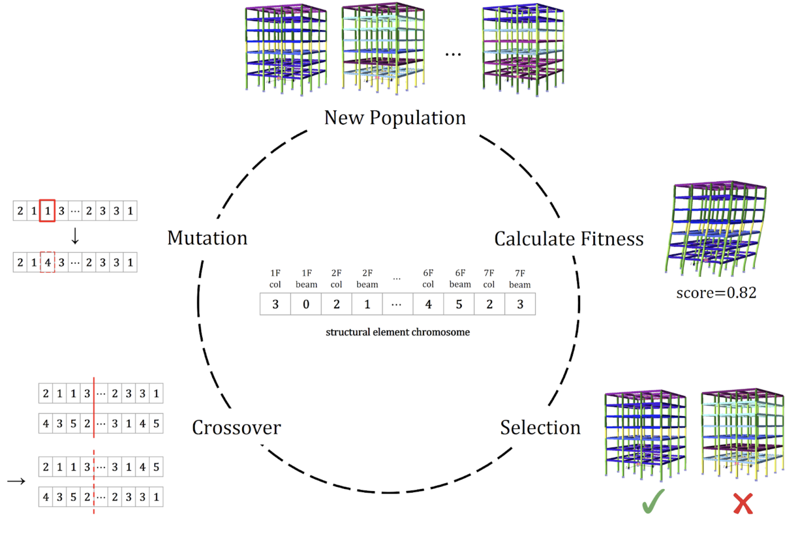
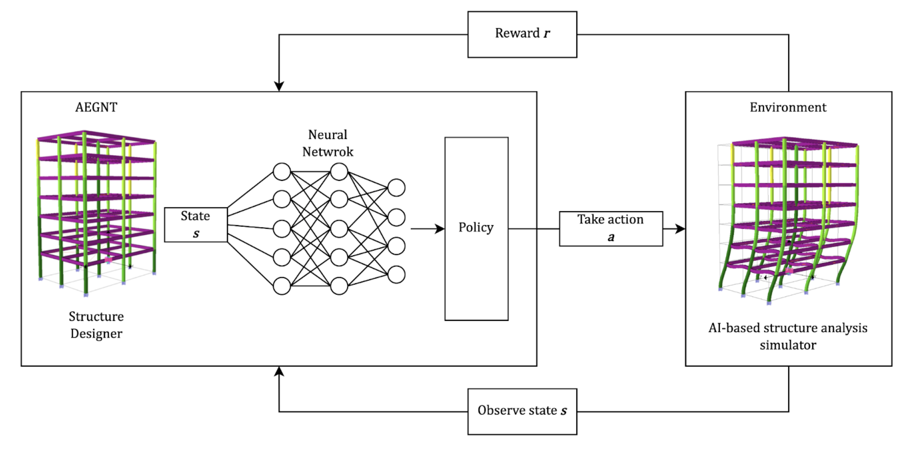
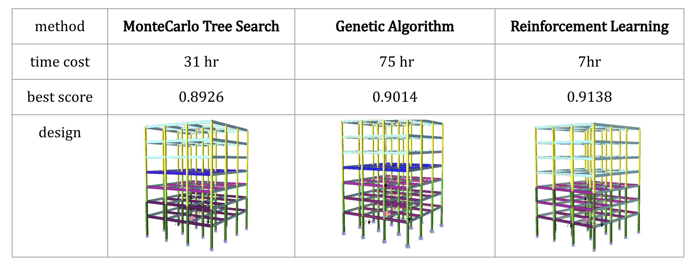

# GA-MCTS-RL-structure-section-optimization

In this project, we aim to optimize the section design of a given structure, in which the strength of the structure is ensured and the cost is minimized. Three searching algorithm: genetic algorithm (GA), reinforcement learning (RL), and monte carlo tree search (MTCS) are leveraged and explored in this project.

### Presentation
- A quick introduction of this project: https://www.youtube.com/watch?v=nJAVA5VJUAg&t=38s
- Slides: https://docs.google.com/presentation/d/145z9AMo-Q6W1Io4kQAsT7XeSqcX2jeyoKMmNaDHIqwc/edit#slide=id.g1318f1d7438_0_0

### Motivation and Background
- When designing a structure building, which beam/column section should be used for each beam/column member plays an important role in structural engeering, as it is related to the structural strength and the design cost.
- However, it is a complex optimization problem, since for each of the beam/column member, it can potentially has 5-10 or more section options, which makes the design space uncountable.
- Here we present several optimization methods using AI to explore the possibility of designing structures with AI.

### Problem Formulation
- We form the structural design problem as a series of searching decisions (21), where
    1. each story of beam/column should have 1 section type assigned 
    2. the most important elements (ex: 1F column) will be decided first
    3. we can get a design score after all elements are assigned with a section type
    4. design score = 0.4 * materialScore + 0.6 * strengthScore

### MonteCarlo Tree Search Formulation

### Genetic Algorithm Formulation

### Reinforcement Learning Formulation (DQN)

### Results

